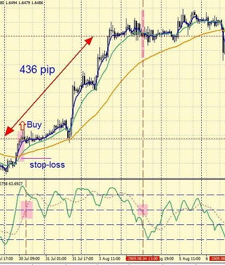
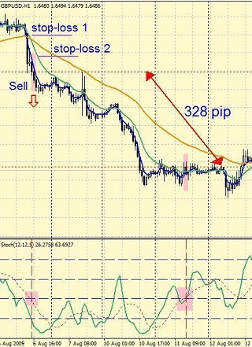

# Forex-Expert-Advisor
Forex Expert Advisor for automation of analytical and trading processes based on strategy EMA (4+13+50) + Stochastic.

## Description of the strategy "EMA (4 + 13 + 50) + Stochastic"
The following forex indicators must be placed on the chart:
* Exponential moving averages: EMA (4), EMA (13), EMA (50).
* Stochastic Oscillator - Stochastic Oscillator (12,9,5), levels - 20, 40, 60, 80.

A buy trade is opened at the open of the next candle after these conditions are met:
1. The moving average EMA (4) crossed the moving average EMA (50) upwards.
2. And after that, the EMA average (13) also crossed the EMA moving average (50) upwards.
Stop loss is set at a distance of either 50-70 points (for GBPUSD) or below EMA (50) - whichever is less, but the correct stop loss should still be below EMA (50).
Exit a trading position - as soon as the dotted line of the Stochastic (% D) crosses the 60 level top down.

For sell trades:
1. The moving average EMA (4) crossed the moving average EMA (50) top down.
2. And after that, the EMA average (13) also crossed the EMA moving average (50) top down.
Exit from a trading position - as soon as the dotted line of the Stochastic (% D) crosses the level 40 upwards.

## Usage
Forex Expert Adviser can be used on trading platforms such as MetaTrader4.
